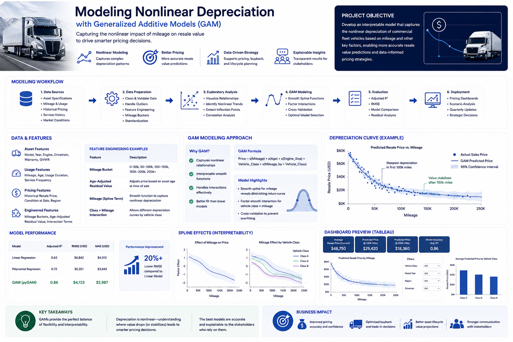

# 📉 Nonlinear Depreciation Modeling
### Modeling Commercial Vehicle Depreciation with Generalized Additive Models (GAM)

**Author:** Brandy Horne  
**Tech Stack:** Python • pyGAM • Machine Learning • Tableau • SQL • Predictive Analytics

---

  

---

# 🚀 Project Overview

Commercial vehicle depreciation is rarely linear. Traditional regression models often assume a constant rate of value loss, but real-world assets experience changing depreciation patterns throughout their lifecycle.

This project applies **Generalized Additive Models (GAMs)** to model the nonlinear relationship between vehicle mileage and resale value. By allowing flexible spline functions instead of fixed linear relationships, the model captures complex depreciation behavior while remaining highly interpretable for business stakeholders.

The resulting model provides pricing teams with more accurate resale estimates and supports strategic inventory planning, buyback decisions, and long-term asset valuation.

---

# ⭐ Key Features

- Nonlinear depreciation modeling
- Smooth spline regression
- Mileage-based pricing predictions
- Feature engineering
- Explainable machine learning
- Tableau executive dashboards
- Pricing optimization
- Model interpretation
- Business-focused analytics

---

# 🎯 Business Problem

Commercial vehicles do not depreciate at a constant rate throughout their lifecycle. Large value declines often occur early in ownership before stabilizing, while different vehicle classes exhibit unique depreciation patterns.

The objective of this project was to develop a predictive model capable of capturing these nonlinear behaviors to improve pricing accuracy and support better business decisions.

---

# 🔍 Business Understanding

Successful pricing required understanding multiple business drivers influencing vehicle value, including:

- Vehicle age
- Mileage
- Usage patterns
- Service history
- Vehicle class
- Warranty status
- Historical market conditions
- Regional demand

The goal was to create an interpretable model that pricing teams could confidently use without sacrificing predictive performance.

---

# 📂 Data Sources

Historical datasets included:

- Vehicle specifications
- Mileage history
- Historical resale prices
- Customer purchasing behavior
- Service and maintenance records
- Market pricing data

Feature engineering transformed raw operational data into variables representing vehicle lifecycle behavior and depreciation trends.

---

# 🧹 Data Preparation

Significant preprocessing was completed before model development.

Activities included:

- Data cleaning
- Missing value treatment
- Outlier removal
- Mileage standardization
- Feature scaling
- Mileage bucket creation
- Age-adjusted residual value calculation
- Interaction feature engineering

The final dataset was optimized for nonlinear modeling while maintaining interpretability.

---

# 🤖 Modeling Approach

## Baseline Models

Traditional linear and polynomial regression models were developed to establish performance benchmarks.

Evaluation highlighted their inability to accurately capture changing depreciation rates across mileage ranges.

---

## Generalized Additive Model (GAM)

The final solution utilized **pyGAM** to model smooth nonlinear relationships between mileage and resale value.

Advantages included:

- Flexible spline functions
- Explainable predictions
- Smooth nonlinear relationships
- Reduced overfitting
- Strong business interpretability

The model also captured interactions between vehicle class and mileage to better represent different depreciation curves.

---

# 📈 Model Evaluation

Model performance was evaluated using:

- Adjusted R²
- RMSE
- MAE
- Cross-validation
- Residual analysis
- Visual spline inspection

Compared with baseline regression models, the GAM improved RMSE by approximately **20%** while providing significantly more interpretable pricing curves.

---

# 📊 Tableau Dashboard

Model outputs were integrated into an interactive Tableau dashboard that enabled pricing analysts and leadership teams to explore depreciation trends.

### Dashboard Features

- Predicted resale values
- Mileage-based pricing curves
- Vehicle class comparisons
- Depreciation trend analysis
- Interactive filtering
- Executive KPI reporting

  

---

# 📈 Business Impact

The solution enabled stakeholders to:

- Improve resale pricing accuracy
- Better understand depreciation behavior
- Support buyback decisions
- Enhance asset valuation strategies
- Increase pricing confidence
- Improve communication with non-technical stakeholders

---

# 🛠️ Technology Stack

### Languages

- Python
- SQL

### Machine Learning

- pyGAM
- Scikit-Learn

### Data Processing

- Pandas
- NumPy
- SciPy

### Visualization

- Tableau
- Matplotlib
- Seaborn

---

# 💡 Key Takeaways

This project demonstrates how Generalized Additive Models provide an ideal balance between predictive accuracy and interpretability for business forecasting problems.

By replacing rigid linear assumptions with smooth nonlinear functions, the model more accurately represents real-world depreciation behavior while remaining intuitive enough for pricing teams to understand and trust.

The project highlights the importance of combining statistical modeling, feature engineering, and business intelligence to transform complex operational data into actionable pricing insights.

---

## 📬 Connect

**Brandy Horne**

- GitHub: https://github.com/brandyhorne01
- LinkedIn: https://www.linkedin.com/in/brandy-horne-20841426/
- Email: brandyhorne01@gmail.com